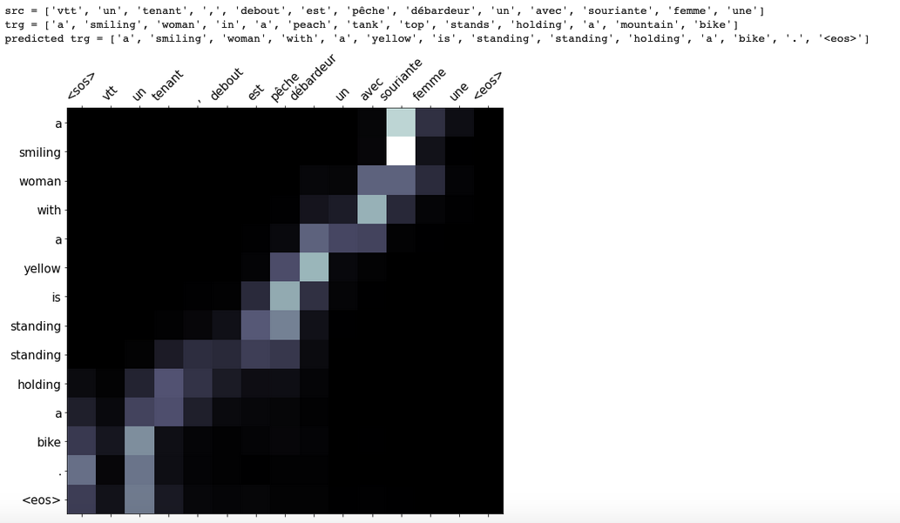

# NMT_EN_FR_ATTENTION
This repo is about the machine translation from French to English.  
<em><b>Dataset</b></em>: English dataset downloaded from Spacy, and French dataset is downloaded from Multi30K 2018 test set. Both of them are tokenized and transferred to lower cases and splited into train, validation and test dataset.  
Only words appear more than 3 times are kept and the model has 20,518,917 trainable parameters. 
<em><b>Encoder</b> </em>and <em><b>Decoder</b></em>: GRU, attention and masking are applied 
<em><b>BLEU score</b></em>: around 39 
<em><b>Visualization</b> </em>of the result: 
src is the input of French sentences and trg is the groud truth, and predicted_trg is the prediction.  
</img>
